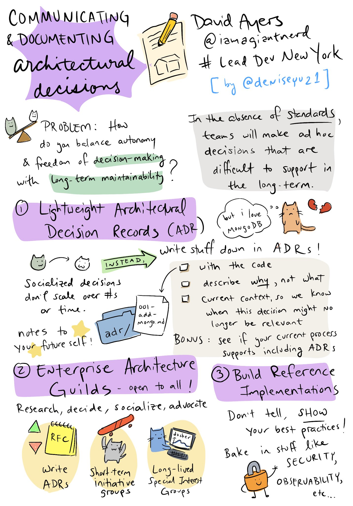

Communicating and Documenting Architectural Decisions
-----------------------------------------------------

Presented by: David Ayers 
Innovative Technology Professional | Passionate Lifelong Learner | Giant Nerd  
[Full Bio](https://github.com/davidaayers/speaker-info/blob/master/bio.md) 
[@iamagiantnerd](https://twitter.com/iamagiantnerd), iamagiantnerd@gmail.com

A talk about communicating and documenting architectural decisions (duh).

Talk Abstract
-------------
Making, documenting, and communicating architectural decisions is one of the hardest things to do, especially in this new age of "agile" architecture and two-pizza teams building and supporting their own software. This talk will go over three techniques to help solve these communication and decision making processes.

Talk Description
----------------
As technologists and technology leaders, we live in an interesting and chaotic time. The days of ivory-tower enteprise architects doling out treatises on approved technologies are over; instead we have agile, two-pizza teams building using emerging architecture techniques and the latest languages. How do we get a handle on this environment and make sure what's being done is documented and communicated out to the larger organization?

In this talk, I'll discuss three techniques that can be used to help:

* Lightweight Architectural Decision Records
* Technical Architecture Guilds
* Building Reference Implementations

All of these may not be right for everyone, but taken together, they can be a powerful force to help document and communicate the decisions that your teams are already making every day.

There are two versions of the talk, one that's 30 minutes (I presented this at The Lead Dev NY, 2019), and one that's 60 minutes (I'm presenting this at the Phx DevOps Meetup in August).

Sketchnote
----------

The awesome [Denise Yu](https://twitter.com/deniseyu21) did this sketchnote of my talk at the #LeadDevNewYork conference, and she kindly agreed to let me save it here. Check out her art on her website: http://www.deniseyu.io/art 

Links:
------

The following links are referenced in the presentation:

- Original Blog Post about ADRs:
  * Michael Nygard: http://thinkrelevance.com/blog/2011/11/15/documenting-architecture-decisions
  * Picture of Michael taken from his public github profile: https://github.com/mtnygard
- Tools:
  * Command line ADR tool: https://github.com/npryce/adr-tools
  * Compendium of ADR information: https://adr.github.io/
- Real world examples of ADRs:
  * https://github.com/npryce/adr-tools/tree/master/doc/adr
  * https://github.com/arachne-framework/architecture
  * https://github.com/marc-bouvier/trello2eisenhower/tree/master/adr
  * https://github.com/hilton/scripting-docs/tree/master/ADR
- Article about Architecture Guilds & ADRs at scale @ Comcast
  * https://www.infoq.com/articles/architecture-guild-800-friends/
  
Credits:
--------
Icons:

* Emoji icons by [Joypixels](https://joypixels.com)
* Dance party icon by [Adioma](https://adioma.com)

Videos:
-------

[Lead Dev New York](https://www.youtube.com/watch?v=rwfXkSjFhzc&feature=youtu.be) 4/30/2019
